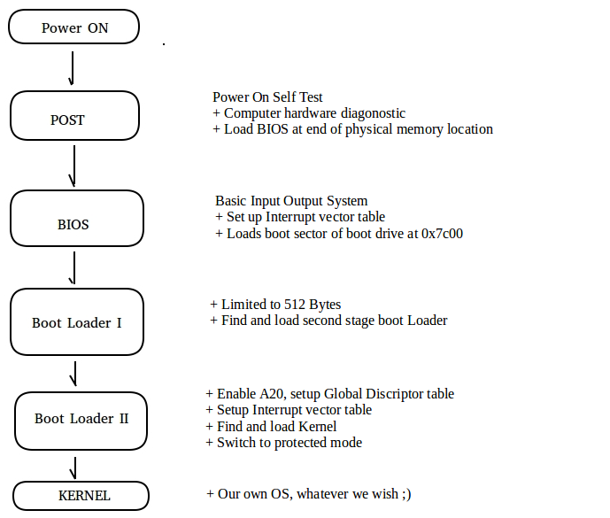

# MUKKA-OS
x86 Architecture operating system implementation work for educational purpose.

## WHEN YOU PRESS POWER BUTTON?



**POST** is a firmware software that perform diagonistic on computer
components, for example if enough power supply is present.  
Its responsibility includes loading BIOS at the end of physical memory,
a jump instruction is placed at physical memory 0x0 to BIOS routine.

Control is transffered to **BIOS**, whoes major responsibility is to
load boot sector of boot drive in memory at location 0x7c00 and pass
control to 0x7c00

**Boot Loader I** loaded at 0x7c00 by BIOS is limited to size 512
bytes. Due to its size constraint its major task is to find and load
second stage boot loader from boot drive to memory and transfer control
to second stage boot loader using BIOS interrupts, we will start our
operating system implementation from this stage, Boot Loader I :)

**Boot Loader II** loaded at memory location 0x500 (because we choosed
to load at this location), major responsibility is to enable Address
line 20, install GDT, install IDT, load kernel in memory,  
switch to protected mode and transfer control to our operating system
kernel.

## CURRENT STATE
### Implemented features
+ Bootloader (512 bytes master boot record)
+ Second stage bootloader
+ Basic VGA text output
+ Kernel in C
+ Software interrupt handling
+ Hardware interrupt handling (in progress)

### Future
+ Hardware abstraction layer
+ Memory management
+ Process Management

## RUNNING AND TESTING OPERATING SYSTEM

This is operating is currently being developed, and is not tested on real
hadware. We can safely run our OS on bochs x86 emulator.

Step 1 : Install Bochs emulator.
         *sudo apt-get install bochs bochs-x bochs-sdl*        
Step 2 : Download all the source code from git-hub
Step 3 : Navigate to the MUCCA-OS folder on the terminal
Step 4 : Execute *MAKE BUILD* on the teminal
Step 5 : Execute *SUDO MAKE INSTALL* 
Step 6 : Execute *sudo bochs -f bochs.txt*   

## DIRECTORY STRUCTURE
SysBoot\                               - Two stage bootloader source-code 
 
      Stage1\                          - Stage1 bootstrap loader
      Stage2\                          - Stage2 KRNLDR bootloder
 
SysCore\                               - System core
 
      Debug\                           - Pre-Release complete builds
      Release\                         - Release builds
      Include\                         - Standard Library Include directory
 
      Lib\                             - Standard Library Runtime.
      Hal\                             - Hardware Abstraction Layer.
      Kernel\                          - Kernel Programs.

## TOOLS AND ENVIRONMENT SETUP FOR GROUND-UP DEVELOPMENT
Things described under this section is only for development from ground-up. 
This section is only for reference in future, and can be skiiped without any
loss of flow. 

### BOCHS

An x86 architecture simulator, will be used for testing and debugging
Operating system.

#### 1) Bochs installation : ####

*sudo apt-get install bochs bochs-x bochs-sdl*

#### 2) Bochs configuration file (bochs.txt):

*megs: 32*
*romimage: file="/usr/share/bochs/BIOS-bochs-latest"*  
*vgaromimage: file ="/usr/share/bochs/VGABIOS-lgpl-latest"*   
*floppya: image=myfloppy.img, status=inserted*  
*boot: floppy*    
*display\_library: x, options="gui\_debug"*  

#### 3) Bochs usage:

*run : bochs -f bochsrc.txt*  
*break-point (debugger) : b &lt;memory location&gt;*  
*continue (debugger) : c*  

### Install script ( these commands execute during *MAKE INSTALL* )

This will be used to create, mount virtual floppy and copy bootloader in
bootsector.

*sudo dd if=/dev/zero of=myfloppy.img bs=512 count=2880*  
*sudo losetup /dev/loop0 myfloppy.img*  
*sudo mkdosfs -F 12 /dev/loop0*  
*sudo mount /dev/loop0 myfloppy -t msdos -o "fat=12"*  
*sudo dd if=LOADER.SYS of=/dev/loop0*  
*sudo cp KRNLDR.SYS myfloppy*  
*sudo umount myfloppy*  
*sudo losetup -d /dev/loop0*  

\*note myfloppy is folder that we have created as mount point of our
virtual floppy.  
\*LOADER.SYS will be our stage one boot loader in binary format.  
\*KRNLDR.SYS will be our stage two boot loader in binary format.  

## BOOT LOADER STAGE ONE

### Tasks of stage one boot loader

+ Print a messege on screen.  
+ load Stage two boot loader  
&nbsp;&nbsp;&nbsp;&nbsp;+ load root directory at (0x7c00 + 0x0200)  
&nbsp;&nbsp;&nbsp;&nbsp;+ search stage two boot loader in root directory  
&nbsp;&nbsp;&nbsp;&nbsp;+ save 1<sup>st</sup> cluster of stage two.  
&nbsp;&nbsp;&nbsp;&nbsp;+ load FAT at (0x7c00 + 0x0200)  
&nbsp;&nbsp;&nbsp;&nbsp;+ load clusters from FAT table starting from save cluster at 0x500  
+ Jump to stage two  

### Boot loader stage one implemetation prerequesite knowledge

#### 1) Drive structure of FAT12 floppy


| Boot Sector | Extra Reserved Sectors | FAT 1 | FAT 2 | Root Directory | Data Region for files |
|-------------|------------------------|-------|-------|----------------|-----------------------|

\*Structure of disk will be defined by BPB entry(refer code) to let
other drivers know about disk stucture

#### 2) FAT is linked list structure, each cluster entry( 12 bits each) stores value of next cluster

Value marks free cluster : 0x00  
Value marks Reserved cluster : 0x01  
This cluster is in use--the value represents next cluster : 0x002 through 0xFEF  
Reserved values : 0xFF0 through 0xFF6  
Value marks bad clusters : 0xFF7  
Value marks this cluster as the last in the file : 0xFF8 through 0xFFF  

#### 3) ROOT directory structure

**Bytes 0-7** : DOS File name (Padded with spaces)  
**Bytes 8-10** : DOS File extension (Padded with spaces)  
**Bytes 11** : File attributes. This is a bit pattern:  
&nbsp;&nbsp;&nbsp;&nbsp;**Bit 0** : Read Only  
&nbsp;&nbsp;&nbsp;&nbsp;**Bit 1** : Hidden  
&nbsp;&nbsp;&nbsp;&nbsp;**Bit 2** : System  
&nbsp;&nbsp;&nbsp;&nbsp;**Bit 3** : Volume Label  
&nbsp;&nbsp;&nbsp;&nbsp;**Bit 4** : This is a subdirectory  
&nbsp;&nbsp;&nbsp;&nbsp;**Bit 5** : Archive  
&nbsp;&nbsp;&nbsp;&nbsp;**Bit 6** : Device (Internal use)  
&nbsp;&nbsp;&nbsp;&nbsp;**Bit 6** : Unused  
**Bytes 12** : Unused  
**Bytes 13** : Create time in ms  
**Bytes 14-15** : Created time, using the following format:  
**Bit 0-4** : Seconds (0-29)  
**Bit 5-10** : Minutes (0-59)  
**Bit 11-15** : Hours (0-23)  
**Bytes 16-17** : Created year in the following format:
&nbsp;&nbsp;&nbsp;&nbsp;**Bit 0-4** : Year (0=1980; 127=2107  
&nbsp;&nbsp;&nbsp;&nbsp;**Bit 5-8** : Month (1=January; 12=December)  
&nbsp;&nbsp;&nbsp;&nbsp;**Bit 9-15** : Hours (0-23)  
**Bytes 18-19** : Last access date (Uses same format as above)  
**Bytes 20-21** : EA Index (Used in OS/2 and NT, dont worry about it)  
**Bytes 22-23** : Last Modified time (See byte 14-15 for format)  
**Bytes 24-25** : Last modified date (See bytes 16-17 for format)  
**Bytes 26-27** : First Cluster  
**Bytes 28-32** : File Size  

### Implmentation of boot loader I

#### 1) Print messege

we will use BIOS interrupt 0x10 – video teletyping output  
AH = 0x0E  
AL = character to write  
BH = Page number (should be zero)  
BL = Foreground color (graphic mode only)  

#### 2) load Stage two boot loader

we will use BIOS **interuppt 0x13** – reading sectors

AH = 0x02  
AL = no of sectors to read  
CH = low 8 bits of cylinder number  
CL = sector number  
DH = Head Number  
DL = drive number  
ES:BX = buffer to read to  

returns:  
AH = status code  
AL = number of sectors read  
CF = set if failure, cleared if success  

we will also use BIOS **interrupt 0x13** to reset floppy disk

AH = 0x0  
DL = drive to reset  

returns  
AH = status code  
CF = set if failure, cleared if success  

## BOOTLOADER STAGE TWO

### Tasks of stage two boot loader

+ Print loading messege   
+ Find and load kernel at 0x30000 using bios interrupts as in boot loader1  
+ Install default GDT  
+ Enable A20 using output port of keyboard controller  
+ Switch to protected mode  
+ Copy kernel image at 0x100000  
+ Jump to kernel  

### Boot loader stage one implemetation prerequesite knowledge

#### 1) Rings of Assembly

Ring 0, Ring 1, Ring 2, Ring 3.The smaller the ring number, the more  
control (and less level of protection), the software has.

#### 2) Real mode V/S Protected mode

##### Real mode

+ No memory protection, all programs text/data are dumped into a single
piece of memory.
+ No support for virtual memory
+ 20 bit address line
+ 16 bit register
+ Segment:offset model, physical address = segment\* 2<sup>4</sup> +
offset
+ Limited to 1MB of memory access
+ No rings of Protection

##### Protected mode

+ Provides memory protection
+ Virtual memory and TSS
+ 4 Rings of protection
+ 32 bit address line and 32 bit register
+ Access to 4GB of memory
+ Descriptor:offset model, desriptor defines memory protection and offset is physical 
  address in memory

#### 3) Global Descriptor table structure

**Bits 56-63:** Bits 24-32 of the base address  
**Bit 55:** Granularity  
&nbsp;&nbsp;&nbsp;&nbsp;**0:** None  
&nbsp;&nbsp;&nbsp;&nbsp;**1:** Limit gets multiplied by 4K  
**Bit 54:** Segment type  
&nbsp;&nbsp;&nbsp;&nbsp;**0:** 16 bit  
&nbsp;&nbsp;&nbsp;&nbsp;**1:** 32 bit  
**Bit 53:** Reserved-Should be zero  
**Bits 52:** Reserved for OS use  
**Bits 48-51:** Bits 16-19 of the segment limit  
**Bit 47:** Segment is in memory (Used with Virtual Memory)  
**Bits 45-46:** Descriptor Privilege Level  
&nbsp;&nbsp;&nbsp;&nbsp;**0:** (Ring 0) Highest  
&nbsp;&nbsp;&nbsp;&nbsp;**3:** (Ring 3) Lowest  
**Bit 44:** Descriptor Bit  
&nbsp;&nbsp;&nbsp;&nbsp;**0:** system Descriptor  
&nbsp;&nbsp;&nbsp;&nbsp;**1:** Code or Data Descriptor  
**Bits 41-43:** Descriptor Type  
**Bit 43:** Executable segment  
&nbsp;&nbsp;&nbsp;&nbsp;**0:** Data Segment  
&nbsp;&nbsp;&nbsp;&nbsp;**1:** Code Segment  
**Bit 42:** Expansion direction (Data segments), conforming (Code Segments)  
**Bit 41:** Readable and Writable  
&nbsp;&nbsp;&nbsp;&nbsp;**0:** Read only (Data Segments); Execute only (Code Segments)  
&nbsp;&nbsp;&nbsp;&nbsp;**1:** Read and write (Data Segments); Read and Execute (Code Segments)  
**Bit 40:** Access bit (Used with Virtual Memory)  
**Bits 16-39:** Bits 0-23 of the Base Address  
**Bits 0-15:** Bits 0-15 of the Segment Limit  

#### 4) CR0 register structure

CR0 is the primary control register. It is 32 bits, which are defined as
follows:

**Bit 0 (PE) : Puts the system into protected mode**  
**Bit 1 (MP) : Monitor Coprocessor Flag** This controls the operation of the **WAIT**   
  instruction.  
**Bit 2 (EM) : Emulate Flag**. When set, **coprocessor instructions will generate an  
  exception**  
**Bit 3 (TS) : Task Switched Flag** This will be set when the processor  
switches to another **task**.  
**Bit 4 (ET)** : ExtensionType Flag. This tells us what type of coprocesor
is installed.  
&nbsp;&nbsp;&nbsp;&nbsp;**0** - 80287 is installed  
&nbsp;&nbsp;&nbsp;&nbsp;**1** - 80387 is installed.  
**Bit 5 (NE):** Numeric Error  
&nbsp;&nbsp;&nbsp;&nbsp;**0** - Enable standard error reporting  
&nbsp;&nbsp;&nbsp;&nbsp;**1** - Enable internal x87 FPU error reporting  
**Bits 6-15 :** Unused  
**Bit 16 (WP):** Write Protect  
**Bit 17:** Unused  
**Bit 18 (AM):** Alignment Mask  
&nbsp;&nbsp;&nbsp;&nbsp;**0** - Alignment Check Disable  
&nbsp;&nbsp;&nbsp;&nbsp;**1** - Alignment Check Enabled (Also requires AC flag set in EFLAGS and ring 3)  
**Bits 19-28:** Unused  
**Bit 29 (NW):** Not Write-Through  
**Bit 30 (CD):** Cache Disable  
**Bit 31 (PG) :** Enables Memory Paging.  
&nbsp;&nbsp;&nbsp;&nbsp;**0** - Disable  
&nbsp;&nbsp;&nbsp;&nbsp;**1** - Enabled and use CR3 register  

#### 5) Keyboard Port Mapping

|  Port   | Read/Write     |  Descripton                         |
|----|------|----------------------------|
|0x60| Read | Read Input Buffer          |
|0x60| Write| Write Output Buffer        |
|0x64| Read | Read Status Register       |
|0x64| Write| Send Command to controller |

#### 6) Keyboard controller commands

| cmd     |    description                       |
|------|--------------------------|
| 0xD0 | Read Output Port         |
| 0xD1 | Write Output Port        |
| 0xDD | Enable A20 Address Line  |
| 0xDF | Disable A20 Address Line |

### BOOTLOADER STAGE TWO IMPLEMENTATION

#### 1)Installing GDT

**Default Code GDT**

*11111111 11111111 00000000 00000000 00000000 10011010 11001111 00000000*

**Default Data GDT**

*11111111 11111111 00000000 00000000 00000000 10010010 11001111 00000000*

**Install GDT :** x86 gdtr instruction

#### 2)Enabling Address line 20 through Keybord controller output port

- Send read output port command(0xD0) t0 keyboard controler port (0x64).
- Read Input Buffer (port 0x60) and store it.
- Send Write output port command(0xD1) to keyboard controller port (0x64).
- Write stored date with bit 1 set to enable A20 to output port (0x60).

#### 3)Switch to protected mode

Enable protected mode bit in control register CR0.

## C KERNEL

### Tool for compiling C kernel

We will be compiling all programs in ELF format, But to avoid hectics of
parsing ELF format and other formats in our own bootlaoder for now, we
will be converting kernel image (after it is being linked with other
object files) from ELF to pure binary using **objcopy**. However we have
planned to build our kernel in ELF format and parse it in future.

#### 1) Linker Script

Used to specify entry point and for calcutation of address of data by
linker.

```
ENTRY( start )
SECTIONS {
.text 0x100000 :
{
code = .; \_code = .; \_\_code = .;
\*(.text)
. = ALIGN(4096);
}
.data :
{
data = .; \_data = .; \_\_data = .;
\*(.data)
\*(.rodata)
. = ALIGN(4096);
}
.bss :
{
bss = .; \_bss = .; \_\_bss = .;
\*(.bss)
. = ALIGN(4096);
}
end = .; \_end = .; \_\_end = .;
}
```

#### 2) Build Script

*nasm -f elf loader.asm*  
*gcc -m32 -nostdlib -nostdinc -fno-builtin -fno-stack-protector -c -o kmain.o kmain.c*  
*ld -m elf\_i386 -T link.ld -o KERNEL.ELF loader.o kmain.o*  
*objcopy -O binary KERNEL.ELF KERNEL.SYS*  

\*loader.asm is kernel entry point (start lable defined here)  
\*kmain.c is C kernel  
\*link.ld is loader script 
